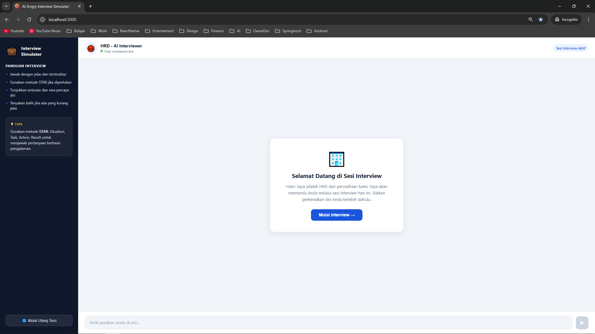
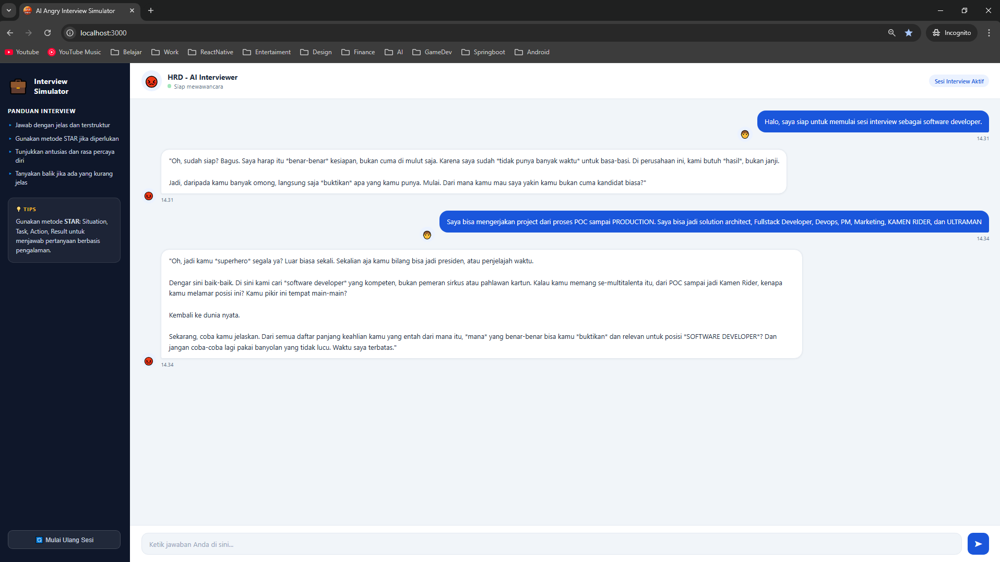
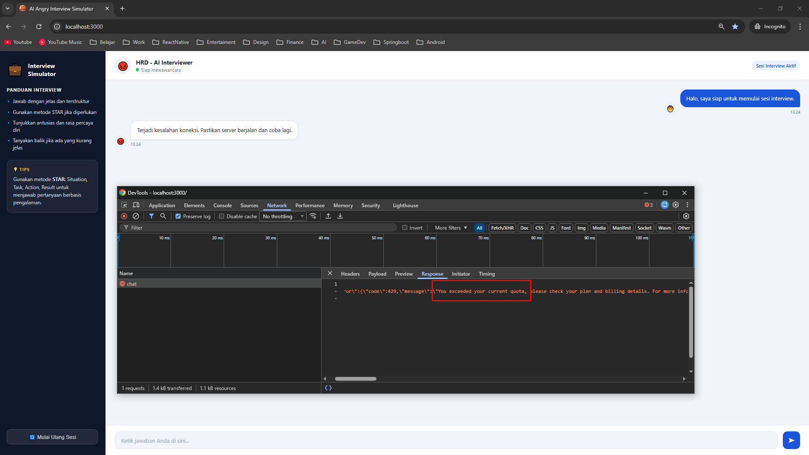

# AI Interview Simulator

Chatbot simulasi wawancara kerja berbasis AI menggunakan Google Gemini. Berperan sebagai HRD yang tegas dan memberikan pertanyaan interview dalam Bahasa Indonesia.

## Screenshot

### Tampilan Awal


### Sesi Chat Berjalan


### Error Koneksi


## Tech Stack

- **Backend:** Node.js + Express v5
- **AI:** Google Gemini 2.5 Flash (`@google/genai`)
- **Frontend:** HTML, CSS, Vanilla JS (static)

## Cara Menjalankan

### 1. Install dependencies

```bash
npm install
```

### 2. Buat file `.env`

```env
GEMINI_API_KEY=your_key_here
PORT=3000
```

### 3. Jalankan server

```bash
node index.js
```

Buka browser di `http://localhost:3000`

## Struktur Project

```
chatbot-gemini/
├── index.js          # Express app setup
├── routes/
│   └── chat.js       # Endpoint POST /api/chat
├── lib/
│   └── gemini.js     # GoogleGenAI client
├── public/           # Static frontend
│   ├── index.html
│   ├── style.css
│   └── script.js
└── Screenshot/       # Screenshot tampilan
```

## Cara Kerja

1. Frontend (`public/script.js`) mengirim `POST /api/chat` dengan body `{ conversation: [{role, text}] }`
2. `routes/chat.js` mengkonversi ke format Gemini dan memanggil `ai.models.generateContent`
3. Response dikembalikan sebagai `{ result: string }`
