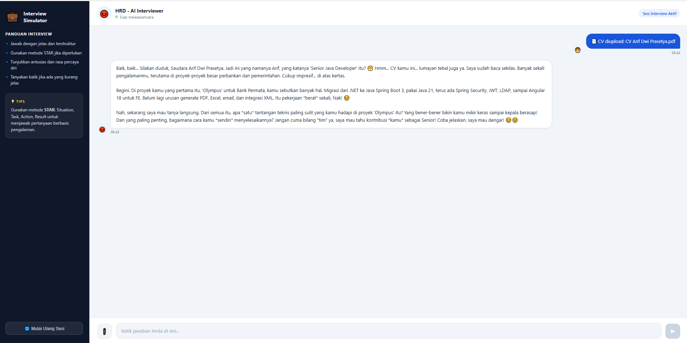

# AI Interview Simulator

Chatbot simulasi wawancara kerja berbasis AI menggunakan Google Gemini. Berperan sebagai HRD yang tegas dan memberikan pertanyaan interview dalam Bahasa Indonesia.

## Fitur

### 🤖 Persona HRD Galak
AI berperan sebagai HRD senior yang tegas dan galak. Setiap respons menggunakan Bahasa Indonesia disertai ekspresi emot untuk memperkuat suasana interview yang intens.

### 📄 Upload CV (PDF)
Kandidat dapat mengupload file CV dalam format PDF. Gemini akan membaca dan menganalisis isi CV secara otomatis, lalu langsung mengajukan pertanyaan interview yang relevan sesuai pengalaman dan skill yang tertera di CV.

### 💬 Riwayat Percakapan
Seluruh percakapan tersimpan sebagai konteks selama sesi berlangsung. AI mengingat jawaban-jawaban sebelumnya sehingga pertanyaan berikutnya tetap relevan dan mengalir seperti interview nyata.

### ⌨️ Input Teks Adaptif
Textarea otomatis menyesuaikan tinggi mengikuti panjang teks yang diketik (hingga 140px), serta mendukung pengiriman pesan dengan `Enter` dan baris baru dengan `Shift+Enter`.

### 🔄 Mulai Ulang Sesi
Tombol reset di sidebar menghapus seluruh riwayat percakapan dan mengembalikan tampilan ke layar sambutan, siap untuk sesi interview baru.

### 📱 Responsive
Tampilan menyesuaikan layar mobile — sidebar disembunyikan dan layout chat dioptimalkan untuk layar kecil.

## Screenshot

### Tampilan Awal


### Sesi Chat Berjalan


### Upload File


### Error Koneksi


## Tech Stack

- **Backend:** Node.js + Express v5
- **AI:** Google Gemini 2.5 Flash (`@google/genai`)
- **Frontend:** HTML, CSS, Vanilla JS (static)

## Cara Menjalankan

### 1. Install dependencies

```bash
npm install
```

### 2. Buat file `.env`

```env
GEMINI_API_KEY=your_key_here
PORT=3000
```

### 3. Jalankan server

```bash
node index.js
```

Buka browser di `http://localhost:3000`

## Struktur Project

```
chatbot-gemini/
├── index.js              # Express app setup
├── routes/
│   ├── chat.js           # Endpoint POST /api/chat
│   └── document.js       # Endpoint POST /api/upload-cv
├── lib/
│   └── gemini.js         # GoogleGenAI client & multer instance
├── public/               # Static frontend
│   ├── index.html
│   ├── style.css
│   └── script.js
└── Screenshot/           # Screenshot tampilan
```

## Cara Kerja

### Alur Chat Biasa
1. Frontend (`public/script.js`) mengirim `POST /api/chat` dengan body `{ conversation: [{role, text}] }`
2. `routes/chat.js` mengkonversi ke format Gemini (`contents: [{role, parts: [{text}]}]`) dan memanggil `ai.models.generateContent`
3. Response dikembalikan sebagai `{ result: string }`

### Alur Upload CV
1. Frontend mengirim `POST /api/upload-cv` sebagai `multipart/form-data` dengan field `cv` (file PDF)
2. `routes/document.js` menerima file via multer, mengkonversi ke base64, lalu mengirim ke Gemini sebagai `inlineData`
3. Gemini membaca isi PDF dan merespons dengan pertanyaan interview berbasis profil CV
4. Respons dan konteks CV disimpan ke `conversation` agar percakapan lanjutan tetap relevan


## Referensi

- [Unicode Full Emoji List](https://unicode.org/emoji/charts/full-emoji-list.html) — daftar lengkap emoji
- [Flaticon](https://www.flaticon.com/) — sumber icon untuk tab browser
- [Gemini API](https://aistudio.google.com/api-keys) - api key